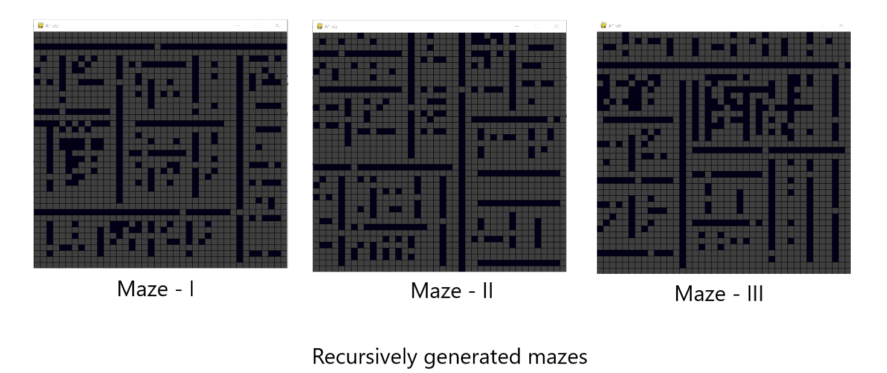

# A* visuallization

<br></br>

working demo  

  
  
A* algorithm is a one of popular techniques for pathfinding and solution search in a given space. This
project implements the said algorithm using pygame module and python 3.10.1 .The features of this project are :

- Random maze generation.
- Color scheme for distinguishability and aesthetics.
- Traced final path.
- Interactivity

### Features 




<br></br>

<center>Interactivity</center>


# Installation

```
$ git clone --depth 1 https://github.com/manas221/Astar-visualization.git
$ cd Astar-visualization
$ python3 -m venv env
$ source ./env/bin/activate
$ pip3 install -r requirements.txt
```

# Usage

**Make sure you run `source ./env/bin/activate` every time you want to run the
program.**

Run main:

```
$ ./main.py
```

# Keybindings

- `SPACE` for starting the simulation

- `b` to generate a maze

- `c` to reset the window

# Inspirational sources


https://youtu.be/JtiK0DOeI4A

https://en.wikipedia.org/wiki/Maze_generation_algorithm

https://weblog.jamisbuck.org/2011/1/12/maze-generation-recursive-division-algorithm

